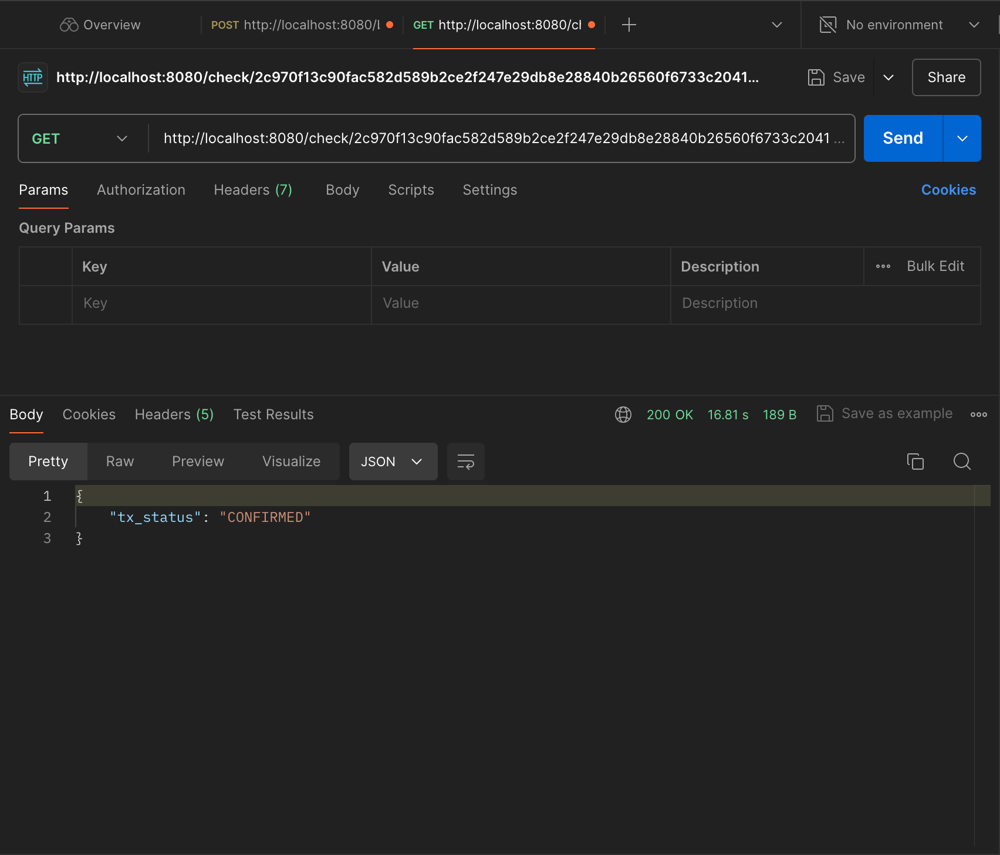

# Transaction Client Project

## Description

This project implements a transaction client for broadcasting and monitoring cryptocurrency transactions. It provides a RESTful API to broadcast transactions and check their status. The client interacts with a mock node service to simulate the transaction process.

## Solution Approach

1. **Broadcast Transaction**:
    - The client sends a POST request to the `/broadcast` endpoint with transaction details (symbol, price, timestamp).
    - The service forwards this request to a mock node service and returns the transaction hash.

2. **Monitor Transaction**:
    - The client can check the status of a transaction by sending a GET request to the `/check/{txHash}` endpoint.
    - The service polls the mock node service to get the current status of the transaction.
    - The service implements a retry mechanism with a maximum of 10 attempts and a 5-second delay between attempts.

3. **Handle Different Transaction Statuses**:
    - The service handles various transaction statuses: CONFIRMED, FAILED, PENDING, and DNE (Does Not Exist).
    - It continues polling for PENDING transactions and returns the final status once confirmed or failed.

## Project Structure
```
+----------------------------------+
| Spring Boot Application          |
|                                  |
| +------------------------------+ |
| |  service                     | |
| |  TransactionClientService    | |
| | +--------------------------+ | |
| | | broadcastTransaction       | |
| | | - Constructs JSON          | |
| | | - POST request             | |
| | | - Returns tx_hash          | |
| | +--------------------------+ | |
| |                              | |
| | +--------------------------+ | |
| | | monitorTransactionStatus   | |
| | | - GET request              | |
| | | - Handles status           | |
| | | - Return tx_status         | |
| | | - Retries if PENDING       | |
| | +--------------------------+ | |
| +------------------------------+ |
|                                  |
| +------------------------------+ |
| | controller                   | |
| | TransactionController        | |
| | +--------------------------+ | |
| | | /broadcast                 | |
| | | - POST endpoint            | |
| | | - Calls                    | |
| | |   broadcastTransaction     | |
| | +--------------------------+ | |
| |                              | |
| | +--------------------------+ | |
| | | /check/{txHash}            | |
| | | - GET endpoint             | |
| | | - Calls                    | |
| | |   monitorTransactionStatus | |
| | +--------------------------+ | |
| +------------------------------+ |
|                                  |
| +------------------------------+ |
| | model                        | |
| | TransactionRequest           | |
| | +--------------------------+ | |
| | | TransactionRequest         | |
| | | - symbol: String           | |
| | | - price: long              | |
| | | - timestamp: long          | |
| | +---------------------------+| |
| +------------------------------+ |
+----------------------------------+        
```

### TransactionClientApplication.java
- Main application class
- Configures Spring Boot application
- Sets up beans for RestTemplate and ObjectMapper
- Implements a CommandLineRunner for demo purposes

### TransactionClientController.java
- REST controller handling HTTP requests
- Exposes endpoints for broadcasting transactions and checking transaction status
- Logs transaction activities

### TransactionClientService.java
- Core service implementing business logic
- Handles communication with the mock node service
- Implements retry logic for monitoring transaction status

### TransactionRequest.java
- Model class representing a transaction request
- Contains fields for symbol, price, and timestamp

## How to Run

1. Ensure you have Java and Maven installed.
2. Clone the repository.
3. Navigate to the project directory.
4. Run `mvn spring-boot:run` to start the application.

## API Endpoints

- POST `/broadcast`: Broadcast a new transaction
  
- GET `/check/{txHash}`: Check the status of a transaction
  

## Testing

Unit tests are provided for the controller and service classes. Run `mvn test` to execute the tests.

## Dependencies

- Spring Boot
- Jackson for JSON processing
- SLF4J for logging
- JUnit and Mockito for testing
